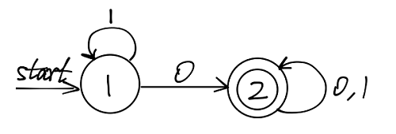

# DFA2RE
convert DFA to regular expression

## How to use
```bash
python3 dfa2re.py [-v] [--method=<method>] [--dfa=<dfa-filename>] [--new] [--cache=<path-to-store-dfa>] 
```

Use `python3 dfa2re.py --help` to see details of the options.

## Example
 

Run
```bash
python3 dfa2re.py --new
```
Then, input the above DFA:
```
#states: 2
src dst value (input "EOF" to break):
1 1 1
src dst value (input "EOF" to break):
1 2 0
src dst value (input "EOF" to break):
2 2 0
src dst value (input "EOF" to break):
2 2 1
src dst value (input "EOF" to break):
EOF
name of start state: 1
list of accept states: (separated by white space)
2
```
The DFA would be stored under the cache dir (the default cache dir is `./sampleDFA`).

The program will output the matrix:
```
1* 1*0(0|1)* 
None (0|1)* 
```
and the regex answer:
```
1*0(0|1)*
```

Now you can try vanilla method. Since the DFA has been cached, you don't need to input it again.
```bash
python3 dfa2re.py --method=vanilla
# ((0|((ε|1)|(ε|1)((ε|1))*(ε|1))(((ε|1)|(ε|1)((ε|1))*(ε|1)))*0)|(0|((ε|1)|(ε|1)((ε|1))*(ε|1))(((ε|1)|(ε|1)((ε|1))*(ε|1)))*0)(((ε|0)|1))*((ε|0)|1))
```

## Attention
If you choose `--method=reduced`, the key step is the `|` operation, i.e. the speed of the program depends on the comparison between `α` and `β` in regex `α|β`. Notice that the time complexity grows exponentially, so it only works for simple DFA. 
